# Gallery

Legend of the Mana Sword has many visual enhancements while staying true to the original graphics.

| Unmodified Final Fantasy Adventure | LotMS (Amanda) | LotMS (Duke) |
| ---------------------------------- | -------------- | ------------ |
|  |  | 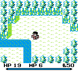 |

* Choose your hero. Play as either Duke (given this name in a Japanese novel) or Amanda, a fellow gladiator.
* The Status Bar is reformatted.
* Currency is changed from Gold to Lucre to match more recent Mana games.

| Unmodified Final Fantasy Adventure | LotMS (Amanda) | LotMS (Duke) |
| ---------------------------------- | -------------- | ------------ |
| 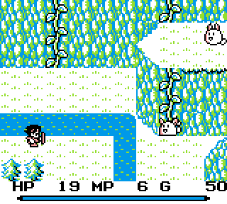 | 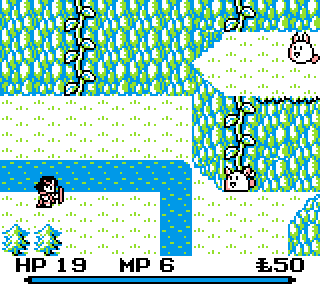 | 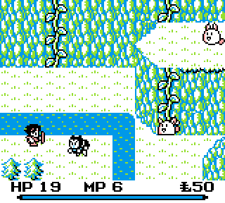 |

* Tweaks to sprites, like the tails of rabites.
* Map improvements like grass next to diagonal sections of cliffs and mountains.

| Unmodified Final Fantasy Adventure | LotMS (Amanda) | LotMS (Duke) |
| ---------------------------------- | -------------- | ------------ |
| 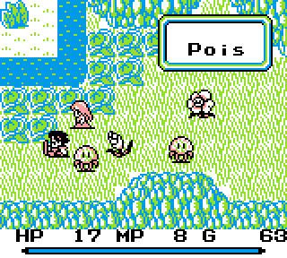 |  | 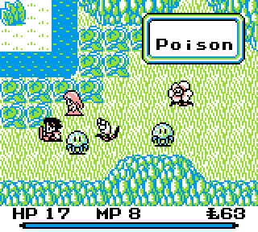 |

* Up to six letter status names.
* More "Lazy DX" color improvements.
* Background tile touchups.

| Unmodified Final Fantasy Adventure | LotMS (Amanda) | LotMS (Duke) |
| ---------------------------------- | -------------- | ------------ |
| 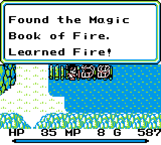 |  | 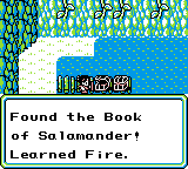 |

* References added to the Mana Spirits, which were not introduced until the second Mana game (Secret of Mana).
* Logic changed so that text windows display at the bottom when possible so less of the playfield is hidden.

| Unmodified Final Fantasy Adventure | LotMS (Amanda) | LotMS (Duke) |
| ---------------------------------- | -------------- | ------------ |
| 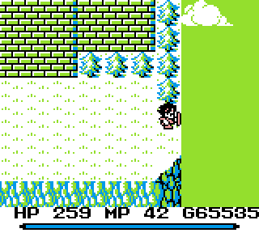 | 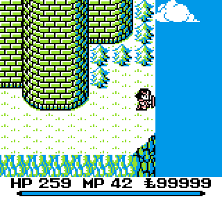 | 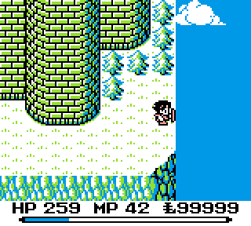 |

* Map improvements. (Actually, this level of change is not common, but this screen is meant to match another screen but originally could not.)
* With "Lazy DX" color improvements the sky is now blue.
* Max money changed from 65535 to 99999.

| Unmodified Final Fantasy Adventure | LotMS (Amanda) | LotMS (Duke) |
| ---------------------------------- | -------------- | ------------ |
|  | 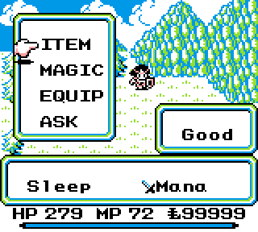 |  |

* Spell names can now be five letters long. Slep renamed Sleep.
* Excalibur (also Excalbur and XCalibr) renamed Mana Sword.
