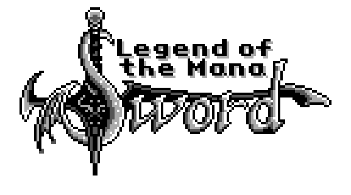

# Legend of the Mana Sword

Legend of the Mana Sword is a rom hack aimed at being the ultimate version of *Final Fantasy Adventure*, the first game in the Mana series. This revitalized version fixes bugs, polishes graphics, updates the script, and includes numerous quality-of-life improvements.

It also has [enhancements for Super Game Boy](sgb.md) with a custom border, and many ["Lazy DX" graphics modifications](lazydx.md) for Game Boy Color (and Game Boy Advance).

Legend of the Mana Sword is a refined experience that enhances this classic while preserving its nostalgic charm. Whether you're curious about where the Mana series started or want to revisit a beloved classic, this is a must-play.

## [Gallery](gallery.md)
Spoiler-free pictures showing some of the visual changes in Legend of the Mana Sword.

## [Get Legend of the Mana Sword](patch.html)
Patch your game with Legend of the Mana Sword.

## [World Map](worldmap.png)
Looking at a world map isn't cheating--a fold-out map came in the box with Final Fantasy Adventure. Although changes are minor that in-box map is now outdated. This is an up-to-date world map for Legend of the Mana Sword.
