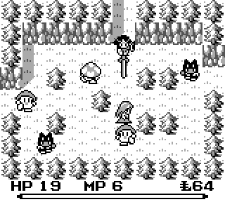
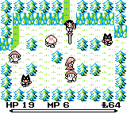
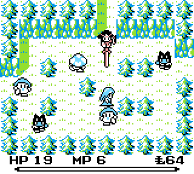
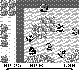
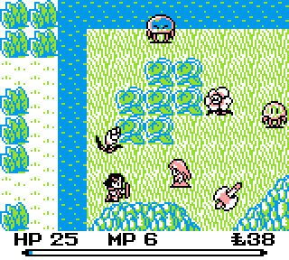
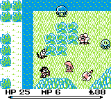
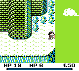
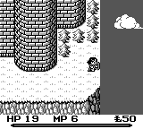

# [Legend of the Mana Sword](./) Lazy DX Colorization

The term "Lazy DX" was coined by amaturehr for a technique for improving colors on Game Boy Color without doing a full colorization. Full colorization usually requires a lot of code changes because most special effects (such as screen fades) do not work the same way.

However the Game Boy Color has a built-in backwards compatibility mode and a game can be optimized to look better when played under it. You can see how amaturehr uses this in [this video from Mega Man World 4 LDX](https://youtu.be/efG_vd0EuZE).

For Legend of the Mana Sword, Lazy DX methods are used to improve sprite and background appearances. 

## Sprites

| Game Boy | Game Boy Color Default | Game Boy Color BIOS | Game Boy Color Lazy DX |
|  |  |  |  | 
|  |  |  |  | 

The Game Boy has two sprite palettes.

For Final Fantasy Adventure  on black and white Game Boys the two palettes are normally identical.

On Game Boy Color there are default colors. Most of the time the two palettes are still the same, but if the BIOS (the code inside the Game Boy Color its self) recognizes a game it can pick other colors.

This rom hack has a change so that the Game boy Color BIOS chooses a specific built in palette. This palette is exactly the same as its default except one of the two sprite palettes uses blue instead of red.

Then certain sprites can be switched to the other palette so they can be blue instead of red or switched back to red instead of the new blue.

Two special effects change one of these palettes: The Dark (Blind) effect and boss damage flash. This means bosses and many enemies need to stay blue. It's a big restriction to this method.

## Backgrounds

| Black & White Original | Color Original | Black & White Modified | Color Modified |
|  |  |  |  

The Game Boy only has one background palette, but on Game Boy Color this palette has green and blue. That allows some nice improvements. For instance, there are some screens that show the sky. Originally on Game Boy Color that sky would have been shown as green, but by changing the graphics it can be blue instead.
