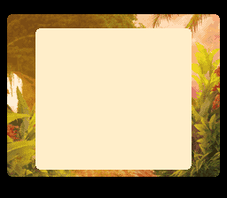

# [Legend of the Mana Sword](./) Super Game Boy enhancements

By far the most notable Super Game Boy enhancement added for Legend of the Mana Sword is a border based on [Orioto](https://www.deviantart.com/orioto)’s magnificent piece, [Vision of a Tree](https://www.deviantart.com/orioto/art/Vision-Of-A-Tree-1010165610).

Super Game Boy development turns out to be difficult to get right on all platforms. During development bugs were found that were unique  to the Japanese only Super Game Boy 2, the European PAL Super Game Boy, various emulators (including a high-precision SNES emulator), and modern FPGA hardware implementations. Fixing a bug in one often resulted in bugs cropping up in more than one other.

Some features were planned, coded, tested, and then abandoned due to limitations and quirks. Others (such as sound improvements) were decided against due to high complexity combined with lack of support in most emulators. Over and over promising Super Game Boy features turned into dead ends.

Most officially licensed games seem to have dealt with this by ignoring Super Game Boy or sticking with a few common enhancements, such as a border.

Despite the many setbacks, in addition to the beautiful border Legend of the Mana Sword has some small Super Game Boy enhancements just for the ending. Future work will mostly go into Game Boy Color improvements as that is a technically much more powerful and robust platform that allows many more colors to be used simultaneously.
